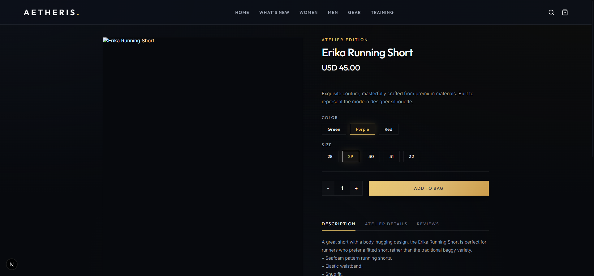
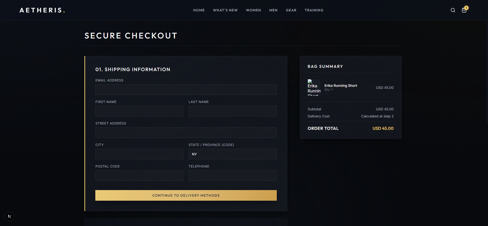
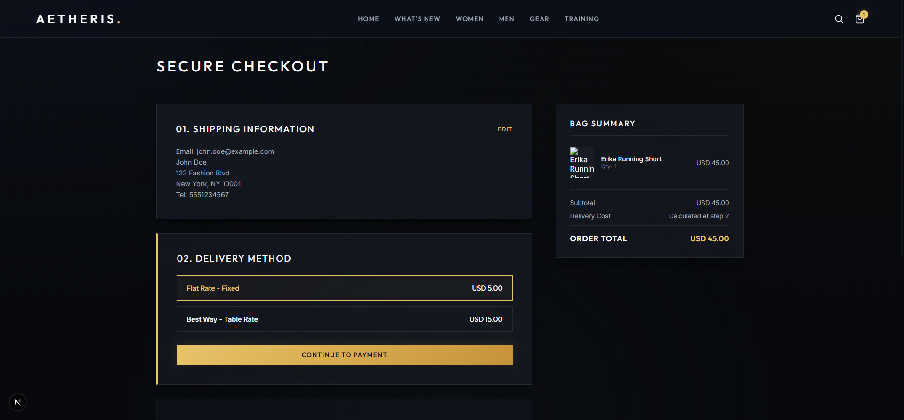
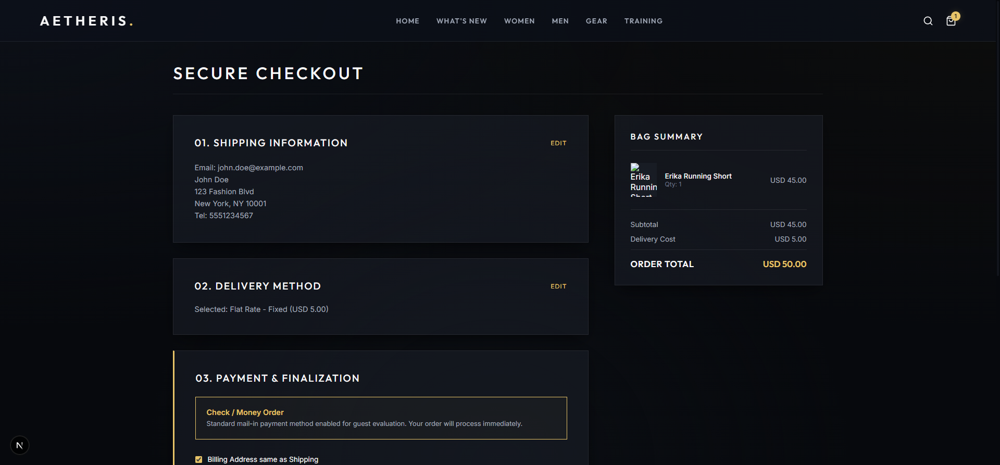
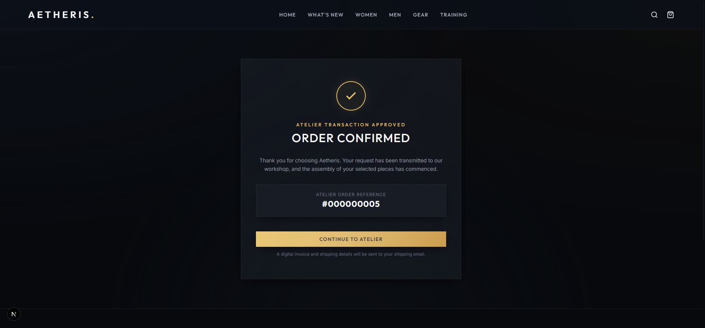

<div align="center">
  
  <h1>Aetheris — Free Next.js Headless Theme for Magento 2 & Mage-OS</h1>
  <p>The fastest, most SEO-optimized open-source headless frontend for Magento and Mage-OS.</p>
  
  [](#)
  [](#)
  [](#)
  [](#)
</div>

<br/>

## 🚀 Stop Losing Sales to a Slow Magento Frontend
Traditional Magento 2 Luma themes are notoriously slow and difficult to optimize for Core Web Vitals. **Aetheris** completely replaces the Magento frontend with a blazing-fast, server-rendered **Next.js (App Router)** application.

By decoupling the frontend from the Magento backend via standard GraphQL, this theme achieves a **97/100 Lighthouse Performance Score** and **100/100 SEO Score** right out of the box.


*(Pictured: The Aetheris Homepage Category Grid)*

## ✨ Key Features
- **Unrivaled Speed:** Built on Next.js 15 App Router with dynamic rendering and static caching strategies.
- **Mage-OS & Magento 2.4.x Compatible:** Fully integrated with standard Magento GraphQL (No custom modules required for the base theme).
- **SEO & Core Web Vitals:** Pre-rendered HTML, optimized images (`next/image`), and dynamic slug routing (`/category/women` instead of base64 UIDs).
- **Modern Glassmorphism UI:** Premium, high-converting design system tailored for fashion, apparel, and lifestyle brands.
- **Headless Checkout:** Fully integrated slide-out cart and multi-step headless checkout process.

### 📸 Screenshots
<div style="display: flex; gap: 10px;">
  
  
</div>
<br/>
<div style="display: flex; gap: 10px;">
  
  
</div>

*(Note: Add your 97/100 Lighthouse Score screenshot as `lighthouse-score.png` to the repository to display it here!)*

---

## 🛠️ Quick Start & Installation

### Prerequisites
- Node.js 18.x or later
- A running Magento 2.4.x or Mage-OS 3.0 backend (local or cloud)

### 1. Clone the Repository
```bash
git clone https://github.com/staksoft/magento-magos-headless-theme-free.git
cd magento-magos-headless-theme-free
```

### 2. Configure Environment
Create a `.env.local` file in the root directory and point it to your Magento GraphQL endpoint:
```env
NEXT_PUBLIC_MAGENTO_GRAPHQL_URL=https://your-magento-domain.com/graphql
```

### 3. Install & Run
```bash
npm install
npm run dev
```
Visit `http://localhost:3000` to view your blazing-fast storefront!

---

## 💼 Need Enterprise Customization or ERP Integration?
This theme provides the perfect foundation for a modern ecommerce stack. However, enterprise ecommerce often requires deep, custom integrations.

If your business needs to integrate **B2B features, custom payment gateways, PIM systems (Akeneo/Pimcore), or legacy Magento extensions**, the **Staksoft** engineering team can help.

As experts in Magento, Mage-OS, and Next.js, we provide high-end staff augmentation and custom development.
👉 **[Hire Staksoft's Magento & Next.js Experts](https://www.staksoft.com/hire/magento-developer)**

---

## 📚 Learn More
Read our deep-dive technical insights on building the fastest Magento architectures:
- [Migrating Magento 2.4.9 Caching from Redis to Valkey](https://www.staksoft.com/insights/magento/migrating-magento-2-4-9-caching-from-redis-to-valkey-8-x)
- [How to Set Up Mage-OS 3.0 Locally with DDEV](https://www.staksoft.com/insights/magento/how-to-set-up-mage-os-3-0-locally-with-ddev-redis-and-opensearch-magento-2-compatible)

## 📄 License
This project is licensed under the MIT License - see the [LICENSE](LICENSE) file for details.
